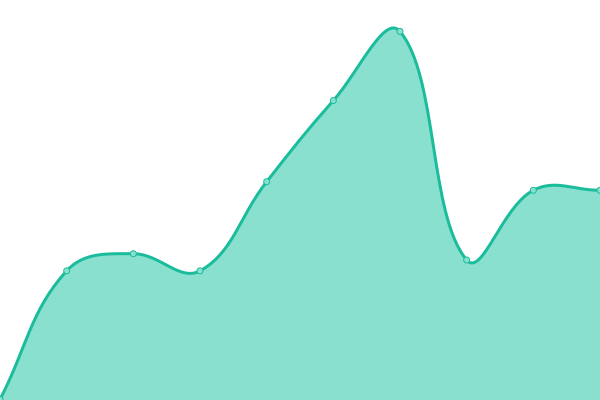
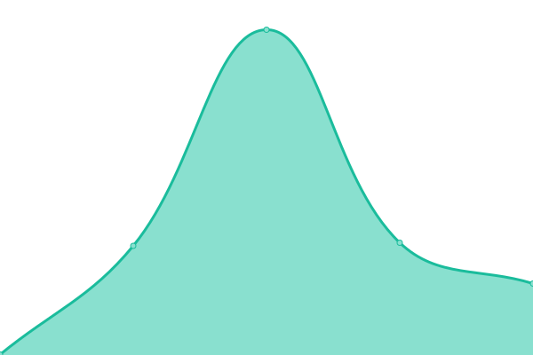
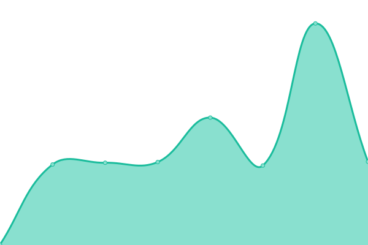

# [📈 Live Status](https://coreeng.github.io/cecg-status): <!--live status--> **🟩 All systems operational**

This repository contains the open-source uptime monitor and status page for [CECG](https://coreeng.github.io/cecg-status), powered by [Upptime](https://github.com/upptime/upptime).

With [Upptime](https://upptime.js.org), you can get your own unlimited and free uptime monitor and status page, powered entirely by a GitHub repository. We use [Issues](https://github.com/coreeng/cecg-status/issues) as incident reports, [Actions](https://github.com/coreeng/cecg-status/actions) as uptime monitors, and [Pages](https://coreeng.github.io/cecg-status) for the status page.

<!--start: status pages-->
<!-- This summary is generated by Upptime (https://github.com/upptime/upptime) -->
<!-- Do not edit this manually, your changes will be overwritten -->
<!-- prettier-ignore -->
| URL | Status | History | Response Time | Uptime |
| --- | ------ | ------- | ------------- | ------ |
|  [cecg.io](https://cecg.io/livez) | 🟩 Up | [cecg-io.yml](https://github.com/coreeng/cecg-status/commits/HEAD/history/cecg-io.yml) | 

 236ms
     
 | 

<a href="https://coreeng.github.io/cecg-status/history/cecg-io">100.00%</a>
    

|  [Core Platform](https://coreplatform.io/livez) | 🟩 Up | [core-platform.yml](https://github.com/coreeng/cecg-status/commits/HEAD/history/core-platform.yml) | 

 411ms
     
 | 

<a href="https://coreeng.github.io/cecg-status/history/core-platform">100.00%</a>
    

|  [Community](https://community.cecg.io/livez) | 🟩 Up | [community.yml](https://github.com/coreeng/cecg-status/commits/HEAD/history/community.yml) | 

 230ms
     
 | 

<a href="https://coreeng.github.io/cecg-status/history/community">100.00%</a>
    

|  [Osterley](https://osterley.cecg.io/livez) | 🟩 Up | [osterley.yml](https://github.com/coreeng/cecg-status/commits/HEAD/history/osterley.yml) | 

 234ms
     
 | 

<a href="https://coreeng.github.io/cecg-status/history/osterley">100.00%</a>
    

<!--end: status pages-->

[**Visit our status website →**](https://coreeng.github.io/cecg-status)

## 📄 License

- Powered by: [Upptime](https://github.com/upptime/upptime)
- Code: [MIT](./LICENSE) © [Anand Chowdhary](https://anandchowdhary.com), supported by [Pabio](https://pabio.com)
- Data in the `./history` directory: [Open Database License](https://opendatacommons.org/licenses/odbl/1-0/)
